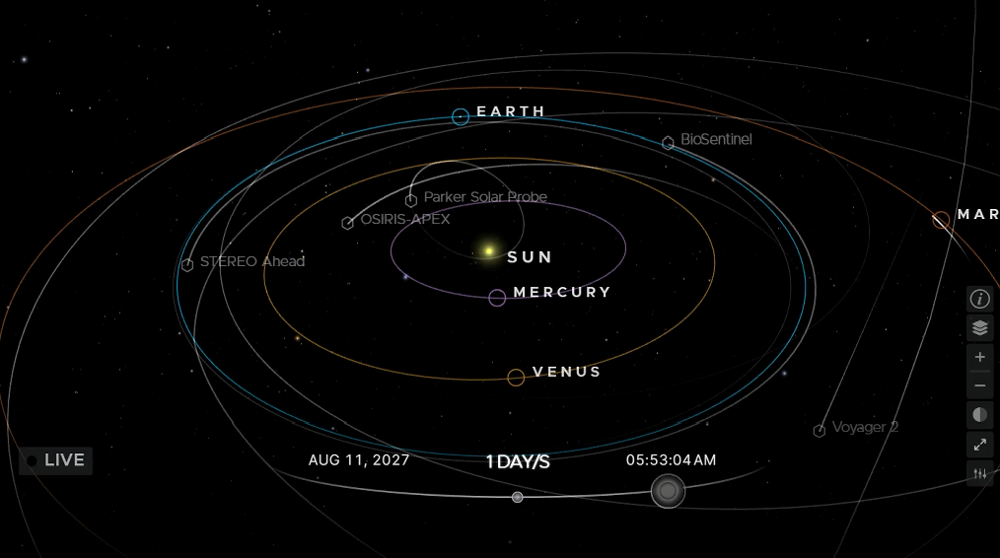
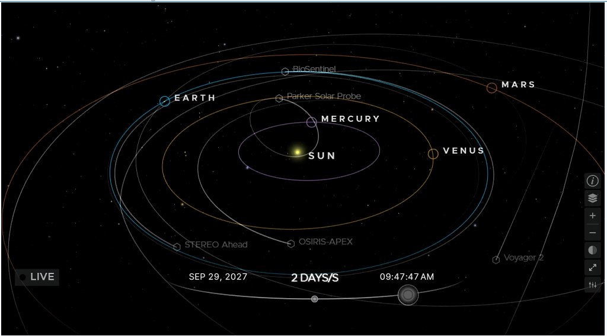

# Formula-Derivation-Understanding-and-Perspectives
# ## ภาพประกอบจากโจทย์

### สถานะ A: การสะสมพลังงาน (มองด้านเดียวกัน)

### สถานะ B: การคืนพลังงาน (มองคนละด้าน)

## Claude AI Categorized by Purpose
[[html original](https://claude.ai/share/cc2bcc9c-ecd8-45b1-b329-3b0077108edd)]() 

# วิถีแรงสมดุลย์ f=0 และความหมายของ f = |r|

> P_true มีหนึ่งเดียว แต่ P_apparent แตกต่างตามระยะและมุมมอง

## 1. ปัญหาที่คนติดตำราเจอ

ตำราสอน: ยิ่งไกล ยิ่งอ่อน -> f = 1/r²
งานของเรา: f ไม่ใช่แรง แต่คือ **ความเบลอของการฉายภาพ** -> f = |r|

## 2. นิยามใหม่ของเรา

- **P_true**: ดวงอาทิตย์จริง อยู่ศูนย์กลางลูกบาศก์ (มีหนึ่งเดียว)
- **P_apparent**: ภาพที่ผู้สังเกตเห็นบนด้านลูกบาศก์
- **f = |r|**: ยิ่งไกลจากศูนย์กลาง ภาพยิ่งเหลื่อม/เบลอ (หน่วย AU)
- **Θ**: ด้านของลูกบาศก์ที่มองเห็น (1 ด้าน = 1 มุมมอง)
- **N_apparent = 1 + Σ Θ·f**: จำนวนภาพเหลื่อมที่ปรากฏ

## 3. โจทย์ตัวอย่าง (ไม่ใช่ตำแหน่งจริง เป็นหุ่นจำลองเพื่อให้เห็นภาพ)

ผู้สังเกต: พุธ 0.39 AU, ศุกร์ 0.72 AU, โลก 1.00 AU
ล้อมดวงอาทิตย์ด้วยลูกบาศก์ N_poly = 6

### สถานะ A: มองด้านเดียวกัน (เช่น 11 AUG 2027 - กระจุกฝั่งเดียวกัน)
- f = 0 -> N_apparent = 1 + 0 = 1
- ทุกคนเห็นตรงกัน นี่คือ **วิถีแรงสมดุลย์**

### สถานะ B: มองคนละด้าน (เช่น 29 SEP 2027 - อยู่คนละฝั่งดวงอาทิตย์)
- f = |r|
- พุธ: 0.39 | ศุกร์: 0.72 | โลก: 1.00
- N_apparent = 1 + 0.39 + 0.72 + 1.00 = 3.11

ค่า 3.11 ไม่ใช่จำนวนดวงอาทิตย์ 3 ดวง แต่คือ **น้ำหนักการเหลื่อมรวม**
- ถ้ามองด้านเดียว = ภาพซ้อนทับกันบนจอเดียว
- ถ้ามองคนละด้าน = ภาพแยกไปคนละด้าน เถียงกันไม่จบ ทั้งที่ P_true มีหนึ่งเดียว

> ถ้าใช้ f = 1/|r| จะได้ 1 + 2.56 + 1.39 + 1.00 = 5.95 และพุธจะเบลอสุด ซึ่งกลับทิศกับความจริงที่ว่า "ยิ่งไกลยิ่งเหลื่อม" จึงต้องเลือก f = |r|

## 4. ทำไมต้องเปรียบกับ c²

ตำราบอก c² คือความเร็วแสงยกกำลังสอง
เรามองว่า c² คือ **อัตราการขยายตัวจากศูนย์กลางเดิม**

ถ้าไม่มีจุดศูนย์กลางให้ขยาย จะไม่มีความเร็วให้วัด
ไอน์สไตน์รู้ว่ามันต้องเป็น c² แต่ยังอธิบายไม่ได้ว่าทำไมต้องยกกำลังสอง

เหมือนกับ f ของเรา — ถ้าไม่เข้าใจว่ามันคือการขยายของภาพ จะเถียงเรื่อง 1/r² ไม่จบ

## 5. สรุปให้คนนอกเข้าใจใน 1 ประโยค

> ตำราบอก f คือแรง = ยิ่งไกลยิ่งอ่อน
> งานเราบอก f คือความเพี้ยนของการมอง = ยิ่งไกลยิ่งเพี้ยน

P_true ไม่เคยเปลี่ยน ที่เปลี่ยนคือ P_apparent

---
*หมายเหตุ: วันที่ในภาพเป็นเพียงแนวทางสร้างโจทย์คำนวณ ไม่ใช่ตำแหน่งโคจรจริงเพื่อพยากรณ์*
